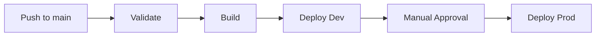

# 🎓 Student Portal - AWS Infrastructure

<div align="center">


**Production-ready Student Portal application deployed on AWS using Terraform and ECS Fargate with complete CI/CD pipelines**

[Features](#-features) • [Quick Start](#-quick-start) • [Architecture](#-architecture) • [Documentation](#-documentation) • [Demo](#-demo)

</div>

---

## 📋 Table of Contents

- [Overview](#-overview)
- [Architecture](#-architecture)
- [Features](#-features)
- [Project Structure](#-project-structure)
- [Prerequisites](#-prerequisites)
- [Quick Start](#-quick-start)
- [Deployment](#-deployment)
- [CI/CD Pipelines](#-cicd-pipelines)
- [Environments](#-environments)
- [Cost Analysis](#-cost-analysis)
- [Security](#-security)
- [Testing](#-testing)
- [Cleanup](#-cleanup)
- [Contributing](#-contributing)
- [License](#-license)

---

## 🎯 Overview

A complete DevOps implementation of a Student Portal application showcasing:

- ✅ **Infrastructure as Code** with Terraform
- ✅ **Containerized** Flask application on ECS Fargate
- ✅ **Multi-environment** setup (Dev/Prod)
- ✅ **Automated CI/CD** with GitHub Actions
- ✅ **Enterprise-grade security** with SSL/TLS, VPC isolation
- ✅ **Auto-scaling** and high availability
- ✅ **Comprehensive monitoring** with CloudWatch

---

## 🏗️ Architecture


### 🛠️ AWS Services Used

| Service | Purpose | Configuration |
|---------|---------|---------------|
| **ECS Fargate** | Serverless container orchestration | Auto-scaling (1-5 tasks) |
| **ALB** | Load balancing & HTTPS termination | Multi-AZ deployment |
| **RDS PostgreSQL** | Managed database | Encrypted, automated backups |
| **VPC** | Network isolation | Public/Private subnets |
| **Route 53** | DNS management | Custom domain support |
| **ACM** | SSL/TLS certificates | Auto-renewal |
| **CloudWatch** | Logging & monitoring | Custom dashboards |
| **ECR** | Container registry | Vulnerability scanning |
| **Secrets Manager** | Credential management | Auto-rotation capable |
| **KMS** | Encryption keys | RDS & EBS encryption |

---

## ✨ Features

### 🚀 Application Features
- **User Authentication** - Secure login/logout system
- **Student Management** - CRUD operations for students
- **Class Tracking** - Attendance and grade management
- **Metrics Endpoint** - Prometheus-compatible `/metrics`
- **Health Checks** - Application health monitoring
- **Responsive UI** - Mobile-friendly interface

### 🔧 Infrastructure Features
- **Auto-scaling** - CPU/Memory-based scaling (1-5 tasks)
- **High Availability** - Multi-AZ deployment
- **SSL/TLS** - HTTPS with automatic certificate renewal
- **Network Security** - Private subnets, security groups
- **Data Encryption** - KMS encryption at rest
- **Disaster Recovery** - Automated backups, snapshots

### 🔄 DevOps Features
- **GitOps Workflow** - Infrastructure as Code
- **CI/CD Pipelines** - Automated build and deploy
- **Environment Promotion** - Dev → Prod workflow
- **Approval Gates** - Production safety checks
- **State Management** - Remote state in S3
- **Zero-downtime Deployments** - Rolling updates

---

## 📁 Project Structure

```
terraform-studentportal-aws/
│
├── 📂 .github/
│   └── 📂 workflows/              # CI/CD Pipelines
│       ├── app-build-deploy-*.yaml
│       ├── infra-deploy-*.yaml
│       └── infra-destroy-*.yaml
│
├── 📂 application/                # Flask Application
│   ├── 📂 app/                   
│   │   ├── 📂 models/            # Database models
│   │   ├── 📂 routes/            # API endpoints
│   │   ├── 📂 templates/         # HTML templates
│   │   └── 📂 static/            # CSS, JS, images
│   ├── 📄 Dockerfile             # Container definition
│   ├── 📄 docker-compose.yml     # Local development
│   └── 📄 requirements.txt       # Python dependencies
│
└── 📂 terraform/                  # Infrastructure as Code
    ├── 📄 *.tf                   # Terraform configurations
    └── 📂 vars/                  
        ├── 📄 dev.tfvars         # Development variables
        └── 📄 prod.tfvars        # Production variables
```

---

## 📋 Prerequisites

### 🔧 Required Tools

| Tool | Version | Purpose |
|------|---------|---------|
| [Terraform](https://www.terraform.io/downloads) | ≥ 1.5.7 | Infrastructure provisioning |
| [AWS CLI](https://aws.amazon.com/cli/) | Latest | AWS interactions |
| [Docker](https://www.docker.com/get-started) | Latest | Container management |
| [Git](https://git-scm.com/) | Latest | Version control |

### ☁️ AWS Requirements
- ✅ AWS Account with appropriate IAM permissions
- ✅ S3 bucket for Terraform state storage
- ✅ Domain name (optional for custom domain)
- ✅ Route 53 hosted zone (if using custom domain)

### 🔑 GitHub Configuration
Configure the following GitHub Secrets:
```yaml
AWS_ACCESS_KEY_ID: ${{ secrets.AWS_ACCESS_KEY_ID }}
AWS_SECRET_ACCESS_KEY: ${{ secrets.AWS_SECRET_ACCESS_KEY }}
```

Create GitHub Environments:
- `production` - For production deployments
- `production-destroy` - For production teardown

---

## 🚀 Quick Start

### 1️⃣ Clone Repository
```bash
git clone https://github.com/YOUR_USERNAME/terraform-studentportal-aws.git
cd terraform-studentportal-aws
```

### 2️⃣ Local Development
```bash
# Start application locally
cd application
docker-compose up -d

# Access application
open http://localhost:8000
```

### 3️⃣ Deploy to AWS (Development)

#### Setup Backend Storage
```bash
# Create S3 bucket for state
aws s3api create-bucket \
  --bucket your-terraform-state-bucket \
  --region ap-southeast-2 \
  --create-bucket-configuration LocationConstraint=ap-southeast-2

# Enable versioning
aws s3api put-bucket-versioning \
  --bucket your-terraform-state-bucket \
  --versioning-configuration Status=Enabled
```

#### Deploy Infrastructure
```bash
cd terraform

# Initialize
terraform init -backend-config=vars/dev.tfbackend

# Plan
terraform plan -var-file=vars/dev.tfvars

# Apply
terraform apply -var-file=vars/dev.tfvars -auto-approve
```

#### Deploy Application
```bash
# Login to ECR
aws ecr get-login-password --region ap-southeast-2 | \
  docker login --username AWS --password-stdin \
  ${AWS_ACCOUNT_ID}.dkr.ecr.ap-southeast-2.amazonaws.com

# Build and push
cd application
docker build --platform linux/amd64 -t studentportal:latest .
docker tag studentportal:latest \
  ${AWS_ACCOUNT_ID}.dkr.ecr.ap-southeast-2.amazonaws.com/dev-studentportal:latest
docker push \
  ${AWS_ACCOUNT_ID}.dkr.ecr.ap-southeast-2.amazonaws.com/dev-studentportal:latest
```

---

## 🚢 Deployment

### 🔄 Using GitHub Actions (Recommended)

<table>
<tr>
<td width="50%">

#### Development Deployment
1. Navigate to **Actions** tab
2. Select **Deploy Infrastructure - Dev**
3. Click **Run workflow**
4. Monitor deployment progress

</td>
<td width="50%">

#### Production Deployment
1. Navigate to **Actions** tab
2. Select **Deploy Infrastructure - Prod**
3. Enter confirmation
4. Approve deployment
5. Monitor progress

</td>
</tr>
</table>

### 📝 Manual Deployment
For detailed manual deployment instructions, see:
- [Application Deployment Guide](application/DEPLOYMENT.md)
- [Infrastructure Deployment Guide](terraform/DEPLOYMENT_GUIDE.md)

---

## 🔄 CI/CD Pipelines

### Pipeline Overview



### 📊 Workflow Matrix

| Workflow | Environment | Trigger | Approval Required |
|----------|-------------|---------|-------------------|
| **Validate Infrastructure** | PR | Pull Request | ❌ |
| **Deploy Infrastructure** | Dev | Push to main | ❌ |
| **Deploy Application** | Dev | Manual | ❌ |
| **Deploy Infrastructure** | Prod | Manual | ✅ |
| **Deploy Application** | Prod | Manual | ✅ |
| **Destroy Infrastructure** | Dev | Manual | ❌ |
| **Destroy Infrastructure** | Prod | Manual | ✅✅ |

### 🛡️ Production Safeguards
- ✅ Manual approval gates
- ✅ Confirmation inputs
- ✅ State backups before destruction
- ✅ Plan review artifacts
- ✅ Deployment summaries

---

## 🌍 Environments

### Development Environment
| Component | Configuration |
|-----------|---------------|
| **URL** | `dev.studentportal.yourdomain.com` |
| **ECS Tasks** | 1-2 (auto-scaling) |
| **RDS Instance** | db.t3.micro |
| **Environment** | Non-production |
| **Cost** | ~$120-150/month |

### Production Environment
| Component | Configuration |
|-----------|---------------|
| **URL** | `prod.studentportal.yourdomain.com` |
| **ECS Tasks** | 2-5 (auto-scaling) |
| **RDS Instance** | db.t3.medium |
| **Environment** | Production |
| **Cost** | ~$220-310/month |

---

## 💰 Cost Analysis

### Monthly Cost Breakdown (Sydney Region)

<table>
<tr>
<td width="50%">

#### Development Environment
| Service | Cost/Month |
|---------|------------|
| ECS Fargate | $20-40 |
| Application Load Balancer | $25 |
| RDS PostgreSQL | $20 |
| NAT Gateway | $45 |
| Other Services | $15 |
| **Total** | **~$120-150** |

</td>
<td width="50%">

#### Production Environment
| Service | Cost/Month |
|---------|------------|
| ECS Fargate | $60-120 |
| Application Load Balancer | $25 |
| RDS PostgreSQL | $70 |
| NAT Gateway | $45 |
| Other Services | $25 |
| **Total** | **~$220-310** |

</td>
</tr>
</table>

### 💡 Cost Optimization Tips
- 🔄 Stop dev environment when not in use
- 🎯 Use Fargate Spot for development
- ⏸️ Enable RDS auto-pause for dev
- 📊 Review CloudWatch logs retention
- 🗑️ Regular cleanup of unused resources

---

## 🔒 Security

### Security Features Implemented

#### Network Security
- ✅ VPC with public/private subnet isolation
- ✅ Security groups with least privilege
- ✅ NAT Gateway for outbound traffic
- ✅ Network ACLs for additional protection

#### Data Security
- ✅ KMS encryption for RDS
- ✅ Encrypted EBS volumes
- ✅ SSL/TLS for all traffic
- ✅ Secrets in AWS Secrets Manager

#### Access Control
- ✅ IAM roles with minimal permissions

---

## 🧪 Testing

### Local Testing
```bash
# Run application locally
cd application
docker-compose up -d

# Test endpoints
curl http://localhost:8000/health
curl http://localhost:8000/metrics
```

### Load Testing
```bash
# Install hey
go install github.com/rakyll/hey@latest

# Run load test
hey -n 10000 -c 200 https://dev.studentportal.yourdomain.com/
```

### Integration Testing
```bash
# Run integration tests
cd application
pytest tests/integration/
```

---

## 🧹 Cleanup

### ⚠️ Development Environment
```bash
# Via GitHub Actions
# Navigate to Actions → Destroy Infrastructure - Dev → Run workflow

# Or manually
cd terraform
terraform destroy -var-file=vars/dev.tfvars -auto-approve
```

### 🚨 Production Environment
**Use GitHub Actions workflow with safety checks:**
1. Navigate to Actions tab
2. Select **Destroy Infrastructure - Prod**
3. Enter triple confirmation
4. Review state backup
5. Approve destruction (2 approvals required)

---

## 🤝 Contributing

We welcome contributions! Please follow these steps:

1. Fork the repository
2. Create a feature branch
   ```bash
   git checkout -b feature/amazing-feature
   ```
3. Commit your changes
   ```bash
   git commit -m 'Add amazing feature'
   ```
4. Push to the branch
   ```bash
   git push origin feature/amazing-feature
   ```
5. Open a Pull Request

### Development Guidelines
- Follow Terraform best practices
- Add tests for new features
- Update documentation
- Ensure CI/CD passes

---

## 📄 License

This project is for educational and portfolio purposes.

---

## 👤 Author

<div align="center">

**Ola Fagbule**

[](mailto:ola.fagbule@gmail.com)
[](https://github.com/YOUR_GITHUB_USERNAME)
[](https://linkedin.com/in/YOUR_LINKEDIN)

</div>

---

## 🙏 Acknowledgments

- AWS Documentation and Best Practices
- Terraform Registry and Community
- Flask Framework Contributors

---

<div align="center">

**Built with ❤️ in Adelaide, Australia**

🌏 **Region:** ap-southeast-2 | 📦 **Terraform:** 1.5.7 | 🐍 **Python:** 3.11

*Last Updated: October 2025*

</div>
